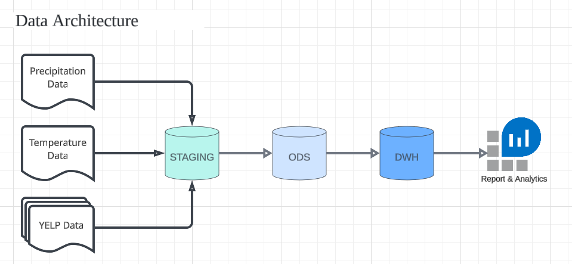

## Data Warehouse DWH for the purpose of reporting and online analytical processing (OLAP)

### Sumary:

In this project scenario, we will use the actual YELP and climate datasets in order to analyze the effects the weather has on customer reviews of restaurants. The data for temperature and precipitation observations are from the Global Historical Climatology Network-Daily (GHCN-D) database. We will architect and design a Data Warehouse DWH for the purpose of reporting and online analytical processing (OLAP) using a leading industry cloud-native data warehouse system called Snowflake.

### Dataset:

- In this project, you will merge two massive, real-world datasets in order to draw conclusions about how weather affects Yelp reviews.

#### 1. YELP DATA (https://www.yelp.com/dataset/download)

- 1 .tgz file compressed, after uncompressed includes: 1 .pdf file and 5 .json files.
  1. [Dataset_User_Agreement.pdf](data/yelp_sample/Dataset_User_Agreement.pdf)
  2. [yelp_academic_dataset_business.json](data/yelp_sample/yelp_academic_dataset_business.json)
  3. [yelp_academic_dataset_checkin.json](data/yelp_sample/yelp_academic_dataset_checkin.json)
  4. [yelp_academic_dataset_review.json](data/yelp_sample/yelp_academic_dataset_review.json)
  5. [yelp_academic_dataset_tip.json](data/yelp_sample/yelp_academic_dataset_tip.json)
  6. [yelp_academic_dataset_user.json](yelp_academic_dataset_user.json)

#### 2. CLIMATE DATA

The data files contain historical weather data for the city of Las Vegas (Nevada) (Weather Station - USW00023169), and were obtained from Climate Explorer(opens in a new tab).

- **Precipitation Data**: [USW00023169-LAS VEGAS MCCARRAN INTL AP-PRECIPITATION-INCH](data/climate/usw00023169-las-vegas-mccarran-intl-ap-precipitation-inch.csv)
- **Temperature Data**: [USW00023169-TEMPERATURE-DEGREEF](data/climate/usw00023169-temperature-degreef.csv)

### Project Instructions:

1. Create a data architechure digram.
2. Create a Staging environment schema in snowflake.
3. Upload all YELP and CLIMATE data to the STAGING environment.
4. Create an OSD environment schema.
5. Draw an entity-relationship (ER) diagram.
6. Migrate the data into ODS environment.
7. Draw a STAR schema for Data Warehouse (DWH) environment.
8. Migration the data to the DWH.
9. Query the DWH.

### Data Architechure Diagram



#### 1. Create DATABASE, SCHEMA for STAGING, ODS, DWH [create_database.sql](./SqlCommands/create_database.sql)

```
-- create UDACITY database for this project
CREATE OR REPLACE DATABASE UDACITY;

-- create STAGING schema
CREATE OR REPLACE SCHEMA STAGING;

-- create ODS (Operational Data store) schema
CREATE OR REPLACE SCHEMA ODS;

-- create DWH (Data Warehouse) schema
CREATE OR REPLACE SCHEMA DWH;

```

#### 2. Staging environment schema in snowflake [load_data_to_staging.sql](./SqlCommands/load_data_to_staging.sql)

```
USE DATABASE UDACITY;
USE SCHEMA STAGING;
```

**Create json and csv File Format**

```
CREATE OR REPLACE FILE FORMAT mycsvformat
TYPE = 'CSV'
COMPRESSION = 'auto'
FIELD_DELIMITER = ','
RECORD_DELIMITER = '\n'
SKIP_HEADER = 1
ERROR_ON_COLUMN_COUNT_MISMATCH = true
NULL_IF = ('NULL', 'null')
EMPTY_FIELD_AS_NULL = true;

CREATE OR REPLACE FILE FORMAT myjsonformat type='JSON' strip_outer_array=true;
```

**Create stage areas**

```
CREATE OR REPLACE STAGE CLIMATE_DATA_STAGE file_format=mycsvformat;

CREATE OR REPLACE STAGE YELP_DATA_STAGE file_format=myjsonformat;
```

**create stage tables**

```
/ *Drop if exists* /
DROP TABLE IF EXISTS STG_TEMPERATURE;
DROP TABLE IF EXISTS STG_PRECIPITATION;

DROP TABLE IF EXISTS STG_YELP_BUSINESS;
DROP TABLE IF EXISTS STG_YELP_USER;
DROP TABLE IF EXISTS STG_YELP_CHECKIN;
DROP TABLE IF EXISTS STG_YELP_REVIEW;
DROP TABLE IF EXISTS STG_YELP_TIP;
DROP TABLE IF EXISTS STG_YELP_COVID;

CREATE TABLE STG_TEMPERATURE ("DATE" STRING, "MIN" STRING, "MAX" STRING, "NORMAL_MIN" STRING, "NORMAL_MAX" STRING);
CREATE TABLE STG_PRECIPITATION ("DATE" STRING, "PRECIPITATION" STRING, "PREPICITATION_NORMAL" STRING);

CREATE TABLE STG_YELP_BUSINESS (BUSINES_INFO VARIANT);
CREATE TABLE STG_YELP_USER (USER_INFO VARIANT);
CREATE TABLE STG_YELP_CHECKIN (CHECKIN_INFO VARIANT);
CREATE TABLE STG_YELP_REVIEW (REVIEW_INFO VARIANT);
CREATE TABLE STG_YELP_TIP (TIP_INFO VARIANT);
CREATE TABLE STG_YELP_COVID (COVID_INFO VARIANT);
```

**UPLOAD file to STAGING**

```
/ *Put the file from local to the staging area* /
put file://climate/usw00023169-temperature-degreef.csv @climate_data_stage auto_compress=true;
put file://climate/usw00023169-las-vegas-mccarran-intl-ap-precipitation-inch.csv @climate_data_stage auto_compress=true;

put file://yelp_dataset/yelp_academic_dataset_business.json @yelp_data_stage auto_compress=true parallel=4;
put file://yelp_dataset/yelp_academic_dataset_review.json @yelp_data_stage auto_compress=true parallel=4;
put file://yelp_dataset/yelp_academic_dataset_checkin.json @yelp_data_stage auto_compress=true parallel=4;
put file://yelp_dataset/yelp_academic_dataset_tip.json @yelp_data_stage auto_compress=true parallel=4;
put file://yelp_dataset/yelp_academic_dataset_user.json @yelp_data_stage auto_compress=true parallel=4;
put file://yelp_dataset/yelp_academic_dataset_covid_features.json @yelp_data_stage auto_compress=true parallel=4;
```

**LOAD file from STAGES to Tables**

```
COPY INTO TEMPERATURES FROM @climate_data_stage/usw00023169-temperature-degreef.csv.gz file_format=mycsvformat ON_ERROR = 'CONTINUE';

COPY INTO PRECIPITATIONS FROM @climate_data_stage/usw00023169-las-vegas-mccarran-intl-ap-precipitation-inch.csv.gz file_format=mycsvformat ON_ERROR = 'CONTINUE';
```
