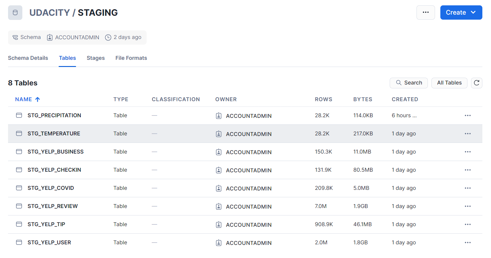
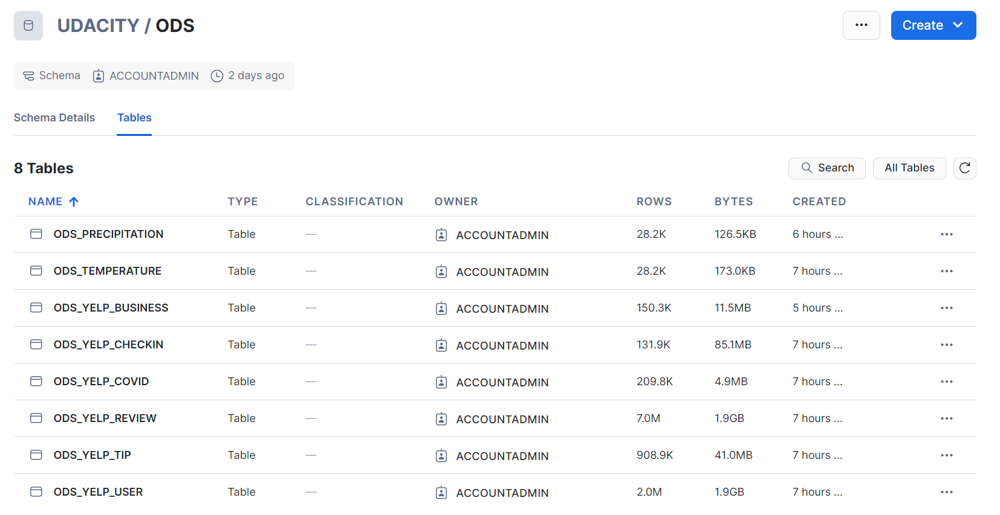
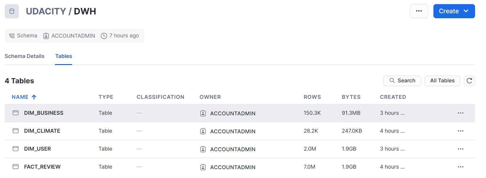

## Data Warehouse DWH for the purpose of reporting and online analytical processing (OLAP)

### Sumary:

In this project scenario, we will use the actual YELP and climate datasets in order to analyze the effects the weather has on customer reviews of restaurants. The data for temperature and precipitation observations are from the Global Historical Climatology Network-Daily (GHCN-D) database. We will architect and design a Data Warehouse DWH for the purpose of reporting and online analytical processing (OLAP) using a leading industry cloud-native data warehouse system called Snowflake.

### Dataset:

- In this project, you will merge two massive, real-world datasets in order to draw conclusions about how weather affects Yelp reviews.

#### 1. YELP DATA (https://www.yelp.com/dataset/download)

- One .tgz file compressed, after uncompressed includes: 1 .pdf file and 5 .json files.
  1. [Dataset_User_Agreement.pdf](data/yelp_sample/Dataset_User_Agreement.pdf)
  2. [yelp_academic_dataset_business.json](data/yelp_sample/yelp_academic_dataset_business.json)
  3. [yelp_academic_dataset_checkin.json](data/yelp_sample/yelp_academic_dataset_checkin.json)
  4. [yelp_academic_dataset_review.json](data/yelp_sample/yelp_academic_dataset_review.json)
  5. [yelp_academic_dataset_tip.json](data/yelp_sample/yelp_academic_dataset_tip.json)
  6. [yelp_academic_dataset_user.json](yelp_academic_dataset_user.json)

#### 2. COVID-19 Dataset (https://www.kaggle.com/datasets/claudiadodge/yelp-academic-data-set-covid-features)

- One json file. [yelp_academic_dataset_covid_features.json](data/yelp_sample/yelp_academic_dataset_covid_features.json)

#### 3. CLIMATE DATA

The data files contain historical weather data for the city of Las Vegas (Nevada) (Weather Station - USW00023169), and were obtained from Climate Explorer(opens in a new tab).

- **Precipitation Data**: [USW00023169-LAS VEGAS MCCARRAN INTL AP-PRECIPITATION-INCH](data/climate/usw00023169-las-vegas-mccarran-intl-ap-precipitation-inch.csv)
- **Temperature Data**: [USW00023169-TEMPERATURE-DEGREEF](data/climate/usw00023169-temperature-degreef.csv)

### Data Architechure Diagram

### Create DATABASE, SCHEMA for STAGING, ODS, DWH

Refer to [create_database.sql](./SqlCommands/create_database.sql)

## 1. Staging

1. Create json and csv File Format
2. Create stage areas
3. create stage tables
4. UPLOAD file to stage Areas
5. LOAD file from STAGES to Tables

Refer to [load_data_to_staging.sql](./SqlCommands/load_data_to_staging.sql)

**Stage areas**

**Staging tables on Snowflake**

## 2. Operational Data Store

LOAD data from stage to ODS refer to [load_stage_to_ods.sql](./SqlCommands/load_stage_to_ods.sql)

**ODS tables on Snowflake**

**ODS data**

## 3. Data Warehouse

LOAD data from ODS to DWH refer to [load_ods_to_dwh.sql](./SqlCommands/load_ods_to_dwh.sql)

**DWH tables on Snowflake**
](images/dwh/dwh_tables.png)

**DWH data**

**Report that clearly includes business name, temperature, precipitation, and ratings.** refer to [report.sql](./SqlCommands/report.sql)

