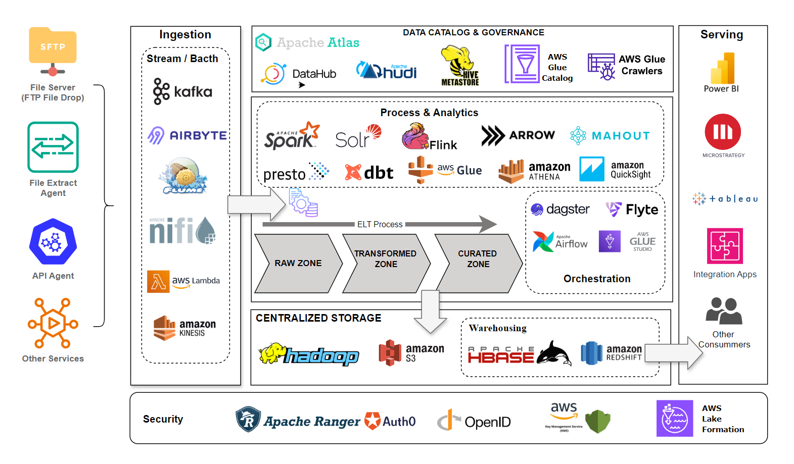

## Design Enterprise Data Lake System for a Medical Data Processing Company

Medical Data Processing Company, based out of San Francisco, specializes in processing various types of EMR (Electronic Medical Records) and provides real-time insights to various medical facilities. These data insights are used by their customers to stay compliant with laws, track patient health metrics, admit discharge records, and bed availability. This service is used by about 8000 individual medical care facilities, including Urgent Care (UC), hospitals, nursing homes, emergency rooms, and critical care units.

The company has experienced hyper growth over the past 3 years. However, as the volume of data continues to grow, the existing infrastructure has not been able to scale. The company has made every type of optimization, configuration changes, and hardware updates, but it has not helped significantly in terms of performance and scale.

### 1. The Problem

Company currently hosts over 8TB of data in SQL Server today. Company has experienced hyper
growth over the past 3 years. However, as the volume of data continues to grow, the existing
single node SQL Server is not able to scale. Currently the company can only process the data
nightly due to the compute capacity limitations. ETL processes and SQL reporting queries are
running slow due to increased data volumes. Company has optimized the database by creating
indexes and upgraded the server hardware to maximum CPU, RAM and storage configurations
that the server can support. However, it has not helped significantly in terms of performance
and scale.

Last week, there was a surge in data, during the nightly ETL process, the database server
crashed and the whole system was offline for several hours. Engineering team has
recommended purging some of the older data to reduce load on the server. Also, there is no
rapid back-up and recovery plan. Hundreds of custom designed scripts (e.g SSIS packages) run
nightly to complete the ETL process. Each script is custom designed to process each type of file.

#### Existing Technical Environment

● 1 Master SQL DB Server  
● 1 Stage SQL DB Server

> o 64 core vCPU  
> o 512 GB RAM  
> o 12 TB disk space (70% full, ~8.4 TB)  
> o 70+ ETL jobs running to manage over 100 tables

● 3 other smaller servers for Data Ingestion (FTP Server, data and API extract agents)
● Series of web and application servers (32 GB RAM Each, 16 core vCPU)

#### Current Data Volume

● Data coming from over 8K facilities  
● 99% zip files size ranges from 20 KB to 1.5 MB  
● Edge cases - some large zip files are as large as 40 MB  
● Each zip files when unzipped will provide either CSV, TXT, XML records  
● In case of XML zip files, each zip file can contain anywhere from 20-300 individual XML
files, each XML file with one record  
● Average zip files per day: 77,000  
● Average data files per day: 15,000,000  
● Average zip files per hour: 3500  
● Average data files per hour: 700,000  
● Data Volume Growth rate: 15-20% YoY

### 2. DataLake Architecture Diagram

#### Business Requirements

● Improve uptime of overall system  
 ● Reduce latency of SQL queries and reports  
 ● System should be reliable and fault tolerant  
 ● Architecture should scale as data volume and velocity increases  
 ● Improve business agility and speed of innovation through automation and ability to
experiment with new frameworks  
 ● Embrace open source tools, avoid proprietary solutions which can lead to vendor lock-in  
 ● Metadata driven design - a set of common scripts should be used to process different
types of incoming data sets rather than building custom scripts to process each type of
data source.  
 Centrally store all of the enterprise data and enable easy access

#### Technical Requirements

● Ability to process incoming files on the fly (instead of nightly batch loads today)  
● Separate the metadata, data and compute/processing layers  
● Ability to keep unlimited historical data  
● Ability to scale up processing speed with increase in data volume  
● System should sustain small number of individual node failures without any downtime  
● Ability to perform change data capture (CDC), UPSERT support on a certain number of
tables  
● Ability to drive multiple use cases from same dataset, without the need to move the
data or extract the data

> o Ability to integrate with different ML frameworks such as TensorFlow  
> o Ability to create dashboards using tools such as PowerBI, Tableau, or
> Microstrategy  
> o Generate daily, weekly, nightly reports using scripts or SQL

● Ad-hoc data analytics, interactive querying capability using SQL

### Project Submisstion

#### 1. Datalake Architecture Diagram

#### 2. Datalake Architecture Design Document

[Datalake-Architecture-Design-Document](DatalakeArchitectureDesign.pdf)

#### 3. Datalake Executive Presentation

[Datalake-Executive-Presentation](DatalakeExecutivePresentation.pptx)
